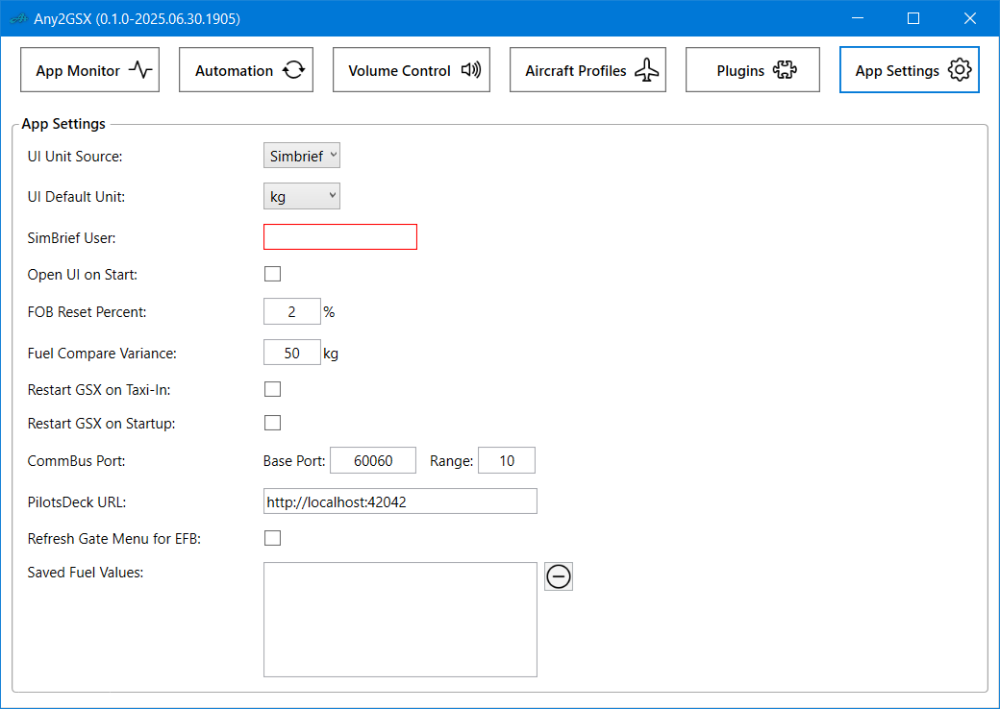

# Any2GSX
 
Generalized Version of [Fenix2GSX](https://github.com/Fragtality/Fenix2GSX) bringing GSX Automation and App Volume Control to all Aircrafts!  

- **GSX Automation** (ie. calling Services, skipping Questions) can be enabled for all Aircrafts
- **App Volume Control** available to all Aircrafts to control the Volume of Apps via Knobs in the Cockpit
- **Aircraft Plugin System** to enable Fuel-, Payload- and Equipment Sync for specific Aircrafts
- **SmartButton** Control for every Aircraft to call the next Service / trigger the next Call (the INT/RAD Thingy known from Fenix2GSX)
- **EFB App** for MSFS2024 to check on the App Status, SmartButton Trigger and GSX Menu
- **PilotsDeck** Integration bringing the GSX Menu to your StreamDeck (replacing the GSX Script known from my PilotsDeck Profiles)

  

## 1 - Introduction

### 1.1 - Requirements

- Windows 10/11
- MSFS 2020/2024
- A properly working and updated GSX Installation (not needed when only Volume Control is used)
- Capability to actually read the Readme up until and beyond this Point :stuck_out_tongue_winking_eye:
- The Installer will install the following Software automatically:
  - .NET 8 Desktop Runtime (x64) - Reboot your System if it was installed for the first Time
  - Any2GSX' CommBus WASM Module

 

[Download Any2GSX-Installer-latest.exe](https://github.com/Fragtality/Any2GSX/raw/refs/heads/master/Any2GSX-Installer-latest.exe)

(Currently only Development Builds available)
  

### 1.2 - Installation, Update & Removal

Just Download & Run the **Installer** Binary! It will check and install Requirements like the .NET Runtime or WASM Module. 
Any2GSX will display a **orange Circle** on its SysTray/Notification Area Icon if a **new Version** (both Stable and Development) is available. Your existing Configuration persists through Updates (stored persistently in the *AppConfig.json* File in the Application's Folder).  
On the second Installer Page you can select if Auto-Start should be set up for Any2GSX (recommended for Ease of Use). While it is possible to install the WASM Module to only one specific Sim Version/Variant, it is recommended to just install it to all. If you choose to install the WASM Module to only one Simulator, make sure you select *Update only existing Installations* when updating the App (else the Module will be installed on all Simulators)! The Force Module Update Option is mostly for Troubleshooting to force an Update of the WASM Module.  
You do **not need to remove** the old Version for an Update (unless instructed) - using 'Remove' in the Installer completely removes Any2GSX (including WASM Module and Auto-Start). This also removes your Configuration including Aircraft Profiles and saved Fuel!  

It is highly likely that you need to **Unblock/Exclude** the Installer & App from BitDefender and other AV-/Security-Software. 
The App will be installed to (cannot be changed): `%appdata%\Any2GSX` (`C:\Users\YOURUSERNAME\AppData\Roaming\Any2GSX`) 
**DO NOT** run the Installer or App "as Admin" - it might work, it might fail.  

### 1.3 - Auto-Start

When starting it manually, please do so when MSFS is loading or in the **Main Menu**. 
To automatically start it with **FSUIPC or MSFS**, select the respective Option in the **Installer**. Just re-run it if you want to change if and how Any2GSX is auto started. Selecting one Option (i.e. MSFS) will also check and remove Any2GSX from all other Options (i.e. FSUIPC), so just set & forget. 
For Auto-Start either your FSUIPC7.ini or EXE.xml (MSFS) is modified. The Installer does not create a Backup (not deemed neccessary), so if you want a Backup, do so yourself.  

#### 1.3.1 - Addon Linker

If you use Addon Linker to start your Addons/Tools, you can also add it there: 
**Program to launch** C:\Users\YOURUSERNAME\AppData\Roaming\Any2GSX\bin\Any2GSX.exe 
**Wait for simconnect** checked 
The Rest can be left at Default. 
  

### 1.4 - Core Concepts & Features

**Aircraft Profiles**

Unless otherwise stated in the App or Readme, the Term 'Aircraft Profile' referrs to the Profiles configurable within the App. So that has nothing to do with the Aircraft Profiles GSX will use. 
Aircraft Profiles are an essential Part of the App, basically the Glue bringing everything together: they determine what Any2GSX Features (GSX Automation, Volume Control, PilotsDeck Integration) should be active for a specific Aircraft and which Aircraft Plugin and/or Audio Channel should be loaded for that. All Automation Settings found in the 'Automation' View are stored per Profile - so together with the Ability to filter on specific IDs, Airlines or Titles/Liveries you can have different Settings for different Airlines having different SOPs to follow (or just having different Operator Preferences for different Airlines). 
 

**GSX Automation**

Within the App, Automation referrs to all Options which either call GSX Services automatically or answer GSX Questions/Pop-Ups automatically. Which is NOT *Integration*: that is understood as the Aircraft and its Systems responding/reacting to GSX Services as they get active (who or what ever called these Services) - so typically Fuel-, Payload- and Ground-Equipment-Sync. 
Any2GSX differentiates between what is an Automation and what is Integration. So even with the GSX *Automation* completely turned off for an Aircraft Profile, the configured Aircraft Plugin will still provide *Integration* like Fuel- and Payload-Sync. AND Ground-Equipment-Sync: so Equipment like Chocks, GPU, PCA is still automatically placed or removed! (Since that is an Response/Reaction to the GSX Pushback Service - see the Definition above). 
In any Case, the Automation works in different Phases reflecting the general Flight State so that the App calls the appropiate Services. For Example calling the Departure Services (Refuel, Catering, Boarding, ...) in the Departure Phase or calling Pushback in the Pushback Phase. The Sequence is: SessionStart -> Preparation -> Departure -> Pushback -> Taxi-Out -> Flight -> Taxi-In -> Arrival -> Turnarond -> Departure. The App can also be (re)started in Flight, where it will directly switch from SessionStart to Flight (and then continue normally). 
 

**Volume Control / Audio Channel Definition**

The Volume Control Features allows to map specific Apps to Audio Channels in the Cockpit (e.g. the App 'vPilot' on Channel 'VHF1'). When that Channel's Volume is manipulated in the virtual Cockpit (e.g. turning the VHF1 Knob), the Volume of the App will be set accordingly. 
It is mostly the same Code as in Fenix2GSX and works the same Way, with on big Difference: For that Feature to work in Any2GSX, you will need an *Audio Channel Definition* File providing the necessary Information of the Aircraft Controls. It basically tells the App what Channels there are and how they can be read. 
These Audio Channel Files are Textfiles containing the Definition in a JSON Notation. So it is relatively easy to extent the App for a specific Aircraft with good Text-Editor (Notepad++, VSCode). The Intention is a bit like GSX' Aircraft or Airport Profiles: knowledgable Users can create these Channel Definitions and can then share that with others. Any2GSX' [Plugin-Repository](https://github.com/Fragtality/Any2GSX-Plugins) can also provide the Channel Definitions in a central Place - so if you have created a Definition and want to share it centrally, just get in Touch with me / open an Issue/PR in the Plugin-Repo to get it added! :+1: 
Note that the whole Volume Control Feature runs completely separate from everything else. So even if you don't use/own GSX at all, you can still use Any2GSX to control the Volume of Apps! 
 

**PilotsDeck Integration**

Any2GSX can Integrate with my StreamDeck Plugin [PilotsDeck](https://github.com/Fragtality/PilotsDeck) (so you need that Plugin on your StreamDeck in order to use this Feature). This Integration serves as an Replacement for the Functionality provided by the GSX Script shared with my PilotsDeck Profiles. 
When the Integration is enabled, Any2GSX will send Data to the Plugin which then can be used by the Plugin's Actions to display Data like the current Flight-Phase, current SmartButton Action, De/Boarding Progress and the whole GSX Menu (color-coded by Service-State while at the Gate). 
So basically you can use your StreamDeck as a complete Replacement for the in-Game GSX Menu and to interface with Any2GSX' Automation. A premade [GSX Pro Profile](https://github.com/Fragtality/PilotsDeck/tree/master/Integrations/GSX%20Pro%20(MSFS)) is available on the PilotsDeck Repository. 
 

**SmartButton**

The SmartButton is a Way to send a Signal to the App that it should call/trigger the next 'Action'. For Example to call the next GSX Service (i.e. call Boarding while Refuel is still active), call Pushback or confirm a good Engine-Start to GSX. For Fenix2GSX Users: it is the INT/RAD Switch Feature in a generalized Form. 
A SmartButton Request can be send via different Ways:
- Aircraft Plugins can map it to actual Cockpit Controls for an 'out of Box' Experience
- When the generic Aircraft Plugin is used, the User can define a SimVar and Comparison for a manual Mapping to a Cockpit Control
- In any Case, it will always monitor the Variable `L:ANY2GSX_SMARTBUTTON_REQ` for Changes for generic Mapping in external App (e.g. like PilotsDeck)
 

**Aircraft Plugins**

Any2GSX does have its own Plugin System to enable Integration with specific Aircrafts - for Example to provide Fuel-, Payload- and Ground-Equipment-Sync. The Intention is that other People can also write Plugins to extent the App for additional Aircrafts. If a Plugin is needed at all: Airplanes with a proper (independent) GSX Integration (like FBW) don't need that. 
Plugins can be directly installed in the UI either from the central [Plugin-Repository](https://github.com/Fragtality/Any2GSX-Plugins) or from a Zip-File when shared externally. As with the Audio Channels: if you created a Plugin and want it to be shared centrally, please get in Touch! 😉 
When no Plugin is available (or needed), the App has a builtin 'generic' Plugin with the Ability to configure/map SimVars to the most basic but essential Aircraft Data (like Avionics powered, Power connected, Nav Lights on, etc). 
Any2GSX has two Plugin Types using different Languages and Approaches: Either as Lua-Script only requiring a (good) Texteditor or as Binary/DLL written in C# requiring a full-blown IDE like Visual Studio. Lua-Plugins are quite powerful, in that they allow Access to all Sim Ressources (i.e. Variables, Events) and provide Access to the Plugin Interfaces - so they can mostly do the same as a Binary Plugin. The Binary Plugins are mostly for Cases where somekind of special Resource (PMDG's SimConnect CDAs) or external Resource (REST-API Call, Memory-mapped File) needs to be interfaced for an Integration with the Aircraft Systems. 
 

**EFB App**

For MSFS 2024, Any2GSX will install an App into the Simulators EFB providing:
- Basic State Information for Any2GSX: Flight-Phase and Status, De/Boarding Progress, loaded Aircraft Profile, current SmartButton Action
- Another Way to toggle a SmartButton Requests
- Alternative Frontend for GSX Menu Interaction

For MSFS 2024 it is recommended to use the EFB App to answer GSX Questions manually. 
 

**CommBus (WASM) Module**

Any2GSX has its own (WASM) Module that needs to be installed into the Sim. The App *cannot* run without that Module installed! 
As the Name suggests it provides the App Access to Simulator's CommBus API providing an additional Way to interface with Aircrafts. 
   

## 2 - Configuration

### 2.2 - GSX Pro

- It is recommended (but not required) to enter your **SimBrief Username** and have **Ignore Time** checked to have correct Information on the VDGS Displays.
- For **Automated staircases** semi-automatic (half-checked) is recommended - but it should work with all Modes.
- It is **not recommended** to use the **Always ask for pushback** Option - use Any2GSX to Answer the Question with Yes, No (default) or answer it manually
- The De-/Boarding Speed of Passengers is dependent on the Passenger Density Setting (GSX In-Game Menu -> GSX Settings -> Timings). Higher Density => faster De/Boarding (But "Extreme" can be to extreme in some Cases).
- Ensure the other two Settings under Timings are on their Default (15s, 1x).
- As with GSX itself, Any2GSX runs best when you have a proper Airport Profile installed!
- Up to everyone's *Preference*, but disabling the **Aural Cues** (GSX In-Game Menu -> GSX Settings -> Audio) and setting **Message verbosity** to "*only Important*" (GSX In-Game Menu -> GSX Settings -> Simulation) can improve Immersion! 😉

  

### 2.3 - Any2GSX

The Configuration is done through the **GUI**, open it by **clicking on the System-Tray/Notification-Icon**. All Settings have **Tooltips** explaining them further. It is recommended to familiarize yourself with the Settings and the general Usage (see [Section 3](#3---usage)) first before starting the first 'serious' Flight with the App!  

The first Time you start the App (or the Config was Reset) it will automatically open the GUI and the '**App Settings**' View - please enter your **SimBrief User** (Name and ID both accepted) for the App to work properly! 
  

After this intial Step you might want to check out the 'Plugins' View to check-out which Aircraft Plugins, Channel Definitions or Aircraft Profiles are available to download (see [Section 2.3.4](#234---plugins-view) for Details).  

Since Any2GSX can be used with all Aircrafts, I'd recommend to check out the '**Aircraft Profiles**' View next to configure if and how it should be active for a specific Aircraft. Check [Section 2.3.3](#233---aircraft-profiles-view) for Details.  

#### 2.3.1 - Automation View

**Gate & Doors**

Configure when Doors, Jetway and Stairs are operated - for Example if Jetway/Stairs should be connected on Session Start and when they should be removed. 
The Jetway & Stair Options apply to all Aircrafts, but the Door-Handling Options only apply to Aircraft-Plugins having their own Door-Sync-Code and have implemented these Settings! 
 

**Ground Equipment**

Mostly the Min/Max Values for the Chock and Final LS Delays. The Chock Delay and remove Equipment on Beacon Options only apply to Aircraft Plugins implementing Chock-/Ground-Equip Handling! 
The Final LS Delay applies to all Aircrafts. It's primarily a Timer which can trigger other Events when expired (like removing the Jetway, or starting Pushback with an attached Tug). 
 

**OFP Import**

Options allowing to modify the OFP Data when imported - for Example to round up Fuel or randomize the Passenger Count. Note that these are only relevant when Any2GSX is providing Fuel- & Payload-Sync through an Aircraft Plugin! 
In addtition the Delays used in the Turnaround Phase can be configured here, which control when Any2GSX will check again for a new OFP on SimBrief. 
 

**Fuel & Payload**

These Options allow to customize Fuel and Payload Handling like the Refuel Rate, Payload-Reset on Startup or FOB Save & Load. 
So they are really Integration Settings, so they still apply when GSX Automation was turned of for the Aircraft Profile. In any Case: they only apply when Any2GSX is providing Fuel- & Payload-Sync through an Aircraft Plugin! 
 

**GSX Services**

Configure if and when GSX Services are called:
- Reposition on Startup (either use Fenix2GSX for that or the GSX Setting - but not both!)
- The Service Activation and Constraints (if and when) as well as Order of the Departure Services (Refuel, Catering, Boarding as well as Lavatory & Water)
- Calling Deboard on Arrival
- If and when Pushback should be called automatically

 

**Operator Selection**

Enable or Disable the automatic Operator Selection. You can also define Preferences to control which Operator is picked by Any2GSX! If no preferred Operator is found, it will use the 'GSX Choice' in the Menu. 
The Preferred Operator List Operator List works only on the *Name* of the Operator as seen in the *GSX Menu*! 
The Strings you add to the Preferred Operator List will be used in a (case insensitive) Substring-Search - so does *Name* listed in the *Menu* contains that Text. The List is evaluated from Top to Bottom - so the higher of two available Operator is choosen. 
 

**Company Hubs**

Manage a List of *Airport* ICAO Codes which define "Company Hubs" for this Aircraft Profile. 1 to 4 Letters per Code. 
The Codes are matched in the Order of the List, from Top to Bottom. For each Code, the Departure ICAO is matched if it starts (!) with the Code - so whole Regions can be matched. 
If the current Departure Airport is matched, Departure Services with the "Only on Hub" Constraint can be called (otherwise they are skipped). So these Hubs have nothing to do with the Operator Selection! 
 

**Skip Questions**

All Options related to skip / automatically Answer certain GSX Questions or Sim Interactions: Crew Question, Tug Question, Follow-Me Question, skipping Walkaround and reopen the Pushback Menu automatically. 
Also the GSX Menu Action triggered from the 'ClearGate' SmartButton Call can be customized (so the Menu after picking the Gate while taxiing to it): per Default it is mapped to select the Option to remove AI Aircrafts from the Gate. But that can also be changed to call the Follow-Me on purpose or even warp to the Gate. 
 

**Plugin Options**

Aircraft Plugins can provide their own Options which are very specific to the Aircraft (e.g. Cargo Lights, Cargo Model/Visual used). If the Plugin has such Options, they can be found in this Category. 
For Aircraft Profiles using the 'generic' Plugin, the Options to define basic Aircraft Data/Information is also located in this Category. For Example Options to map the SmartButton to a Cockpit Control, define an additional Trigger for the Departure Phase and most importantly Variables providing Aircraft Power & Light States. The Later are essential for the App's Phase and Automation Flow:

- Avionics powered: Signaling if the essential Aircraft Systems are powered - so typically always true once the Aircraft was woke up from Cold & Dark. Used to determine when Volume Control should become active and is also used for evaluating if the Aircraft is ready for Departure Services.
- External Power available & connected: Signaling if Ground Power is available and when it is connected. The connected State is also used to evaluate if the Aircraft is ready for Departure Services.
- Beacon & Nav Lights: Signaling when the Lights are on (like actually on, not just the Switch Position). The Nav Lights are used for the ready-for-Departure Evaluation and the Beacon (depending on Configuration) to trigger the Pushback Call.
- Parking Brake: Signaling when the Parking Brake is set. Essential Check used in various Phases.

For each of these Variables a Name and a Unit has to be provided (L-Vars have to be prefixed with `L:`). If in Doubt, use the Unit `Number`. All Variable used must evaluate to true/non-zero to indicate the on/connected/available State!
 
 

#### 2.3.2 - Volume Control View

Any2GSX will only start to control Volume once the Plane's Avionics are powered. Once the Aircraft is powered, Any2GSX will set each Audio-Channel to the configured Startup State (e.g. 100% Volume and unmuted for VHF1). To customize the Startup State, select the appropiate Channel and set the Volume and Mute State that should be set. 
When the Sim Session has ended or Any2GSX is closed, it will try to reset all Audio Sessions of the controlled Applications to their last known State (before it started controlling the Volume). That might not work on Applications which reset their Audio Sessions at the same Time (like GSX). So GSX can stay muted when switching to another Plane (if it was muted) - keep that in Mind. 
Any2GSX will control all Audio Sessions on all Devices for a configured Application by default. You can change the Configuration to limit the Volume Control to a certain Device per Application - but on that Device it will still control all Sessions at once. 
By default, Any2GSX will only consider App Audio Sessions which are flagged as active. Some Apps (like MSFS2024) can spawn inactive Sessions which become active later or by Demand. In that Cases 'Only active' has to be unchecked to also include inactive Sessions.  

You can map freely Applications to any of the Aircraft's Channels - as defined by the selected Audio Channel in the loaded Aircraft Profile. All Mappings are associated to the Aircraft Profile so they are also automatically loaded when the Session starts. 
To identify an Application you need to enter it's Binary Name without .exe Extension. The UI will present a List of matching (running!) Applications to your Input to ease Selection. The Use Mute Checkbox determines if the pulling or pushing the Volume Knob is used as Trigger to unmute or mute the Application.  

Some Audio Devices act 'strangely' or throw Exceptions when being scanned by Any2GSX for Audio-Sessions. If you have such a Device, you can add it to the Blacklist so that Any2GSX ignores it (normally it should automatically add Devices throwing Exceptions). 
But there also Cases where Input (Capture) Devices are reported as Output (Render) Devices which leads to Any2GSX controlling the Volume of your Microphone! In such Cases these "false-output" also need to be added to the Blacklist. 
Matching is done on the Start of the Device Name, but it is recommended to use the exact Device Name for blacklisting. Tip: when you hit Ctrl+C on the Device Dropdown (under App Mappings), the selected Device's Name is automatically pasted to Blacklist Input Field.
  

#### 2.3.3 - Aircraft Profiles View

  

#### 2.3.4 - Plugins View

  

#### 2.3.5 - App Settings View

   

### 3 - Usage

#### 3.1 - General Service Flow / SOP

#### 3.1.1 - Session Start

  

#### 3.1.2 - Preparation Phase

  

#### 3.1.3 - Departure Phase

  

#### 3.1.4 - Pushback Phase

  

#### 3.1.5 - Taxi-Out Phase

  

#### 3.1.6 - Flight Phase

  

#### 3.1.7 - Taxi-In Phase

  

#### 3.1.8 - Arrival Phase

  

#### 3.1.9 - Turn-Around Phase

  

#### 3.2 - SmartButton Calls

   

## 4 - Addon NOTAMs

   

## 5 - NOTAMs (Usage Tips)

   

## 6 - FCOM (Troubleshooting)

   
